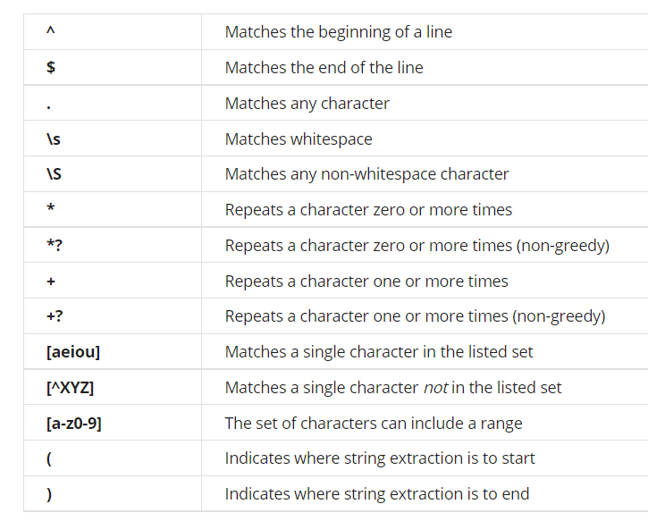
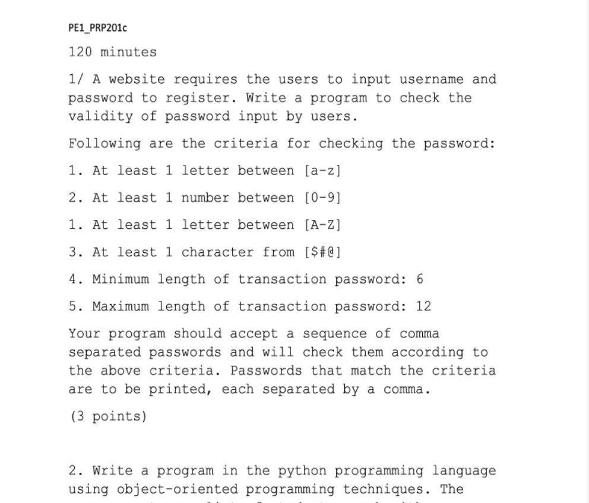
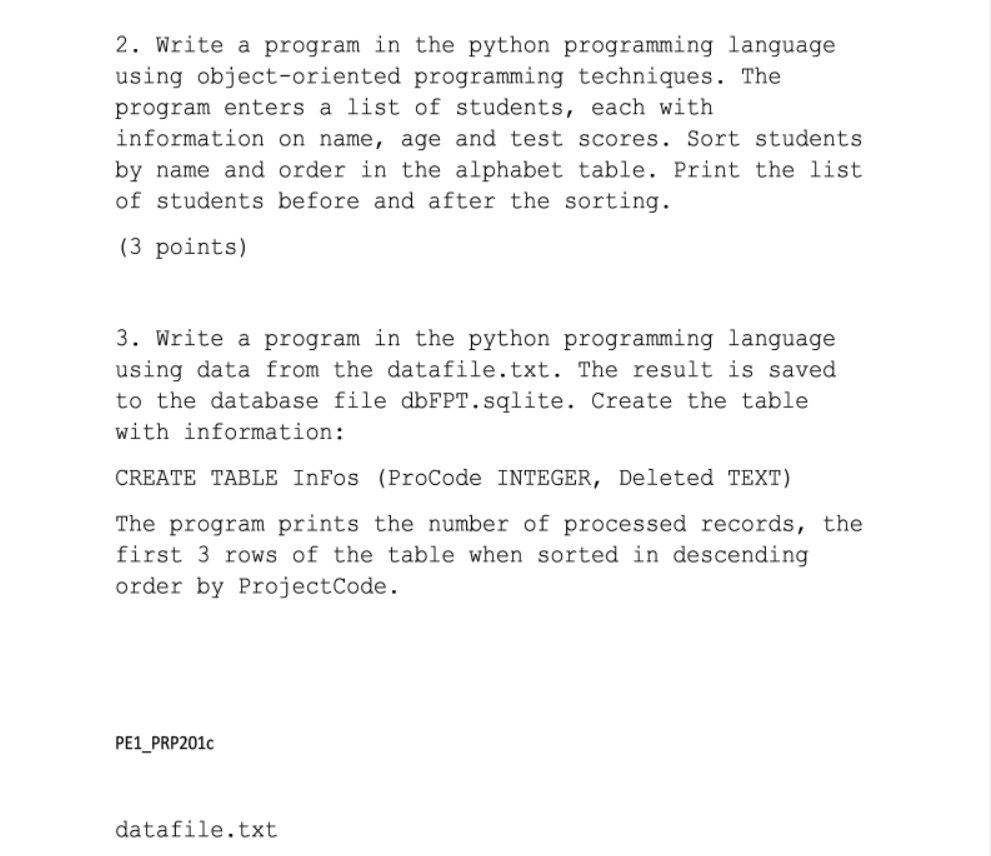
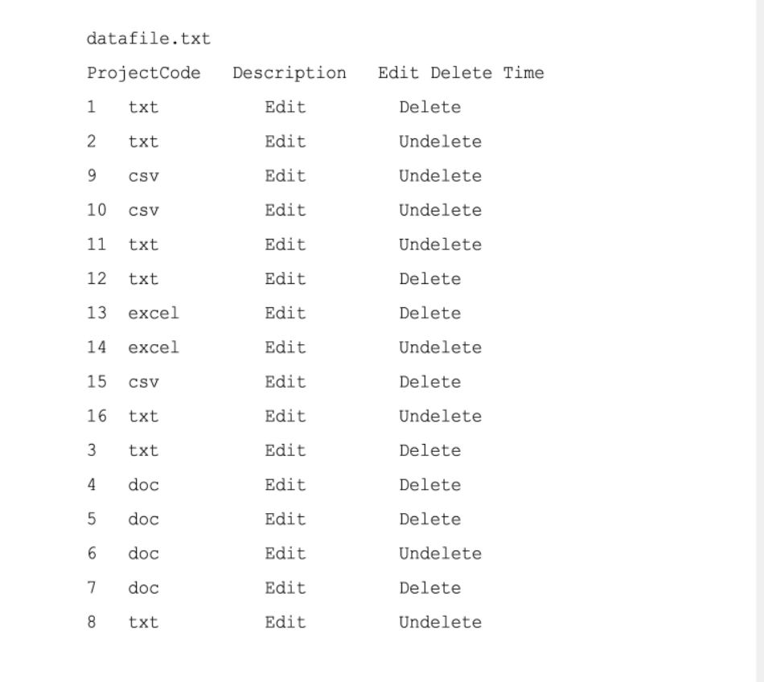
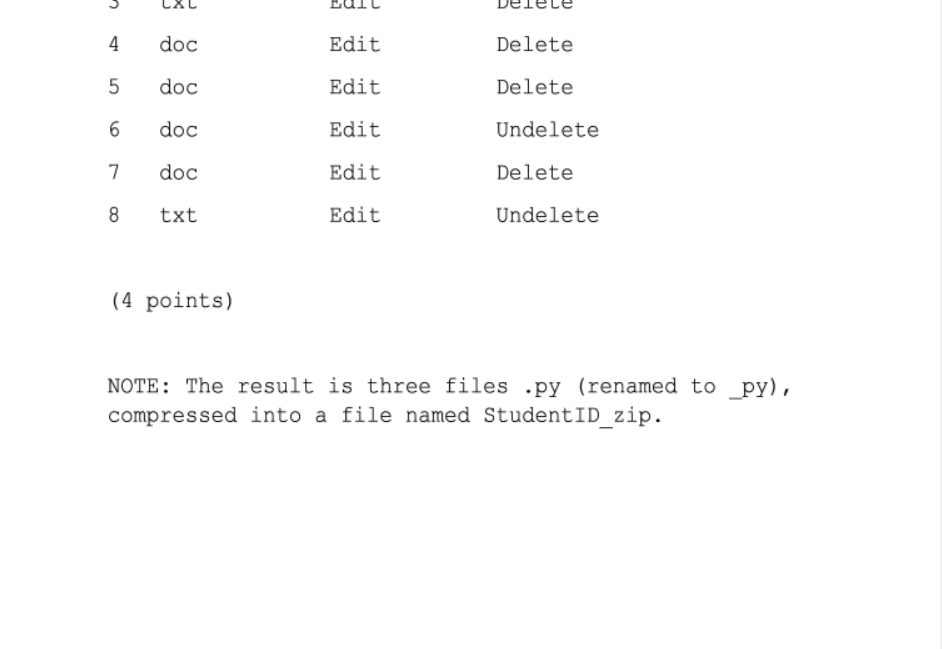

# How to pass prp201c FPTU
## Table of contents
[Review course 1: Programming for Everybody (Getting Started with Python)](#course1)

[Review course 2: Python Data Structures](#course2)

[Review course 3: Using Python to Access Web Data](#course3)

[Review course 4: Using Databases](#course4)

[Example Practical Exam](#pe)

[Final Exam](#fe)

<a name="course1"></a>
## Review course 1: Programming for Everybody (Getting Started with Python)
### Variable & Expression
```python
x = 5
print(x)
```
### Condition statement (If else)
```python
if 5 > 3:
  print("5 is greater than 3")
```
### Function
```python
def hello(name):
    print("Hello, {name}")
hello("David")
```
### Loop and Iteration
Python has two primitive loop commands:

while loops
for loops

```python
i = 1
while i < 6:
    print(i)
    i += 1
  
fruits = ["apple", "banana", "cherry"]
for x in fruits:
    print(x)
```
<a name="course2"></a>
## Review course 2: Python Data Structures
### Manipulate strings

    Compare strings

    lower(), 

    upper(), 

    rstrip([chars]), 

    lstrip([chars]),

    strip([chars),

    replace(old, new [,count]), 

    capitalize(), 

    center(width[, fillchar])

    endswith(suffix[, start[, end]]),

    find(sub[, start[, end]])

    len(param)

### Files

Open file:  open(filename, mode)

mode:

`"r"` - Read - Default value. Opens a file for reading, error if the file does not exist

`"a"` - Append - Opens a file for appending, creates the file if it does not exist

`"w"` - Write - Opens a file for writing, creates the file if it does not exist

`"x"` - Create - Creates the specified file, returns an error if the file exists

```python
fhand = open('mbox', 'r')
```
Read file
```python
s = fhand.read()
```
Close file, **remember close file when done if you add data to file**
```python
fhand.close()
```
For go to new line, append `"\n"`
```python
f.write("Now the file has more content!\n")
```
Example:
```python
f = open("demofile3.txt", "w")
f.write("Woops! I have deleted the content!")
f.close()

# open and read the file after the appending:
f = open("demofile3.txt", "r")
print(f.read())
```
<a name="final-quiz"></a>
### List
List is a kind of collection
```python
mylist = [1, [5, "cherry"], 'banana', "\n", 2.4, True]
print(len(mylist) # Output: 6
print(mylist[1]) # Output: [5, 'cherry']

fruits = ["apple", "banana", "cherry"]
print(",".join(fruits)) # Output: apple,banana,cherry
fruits.sort(reverse=True)
print(fruits) # Output: ['cherry', 'banana', 'apple']
```
Create empty list: `lst = list()`
### Dictionaries
A dictionary is a collection which is ordered*, changeable and does not allow duplicates.

*As of Python version 3.7, dictionaries are ordered. In Python 3.6 and earlier, dictionaries are unordered.*
```python
thisdict = {
  "brand": "Ford",
  "model": "Mustang",
  "year": 1964
}
x = thisdict["model"]
print(x)
thisdict["year"] = 2018
thisdict["color"] = "red"
thisdict.pop("model")
for x in thisdict:
  print(x)
mydict = thisdict.copy() # copy dictionary
```
Nested Dictionary
```bash
myfamily = {
  "child1" : {
    "name" : "Emil",
    "year" : 2004
  },
  "child2" : {
    "name" : "Tobias",
    "year" : 2007
  }
}
```
## Tuples
Tuples are like the lists but tuples are *immutable*.
Tuples are used to store multiple items in a single variable.
```python
thistuple = ("apple", "banana", "cherry")
```

<a name="course3"></a>
## Review course 3: Using Python to Access Web Data
### Regular Expressions
#### Import regular expressions library
```python
import re
```
#### Search in strings: `re.search(pattern, string)`
```python
import re

hand = open(`mbox-short.txt`)
for line in hand:
    line = line.rstrip()
    if re.search('From:', line): # search line contain 'From:'
        print(line)
```
```python
import re

s = '122ab'
if re.search("[0-9]", s): # True
    print("Contain at least 1 number")
```
#### Extracting data: `re.findall(pattern, string)`
```python
import re

x = 'My 2 favorite numbers are 19 and 42'
y = re.findall('[0-9]+', x)
print(y)  # Output: ['2', '19', '42']
```
Some regular expressions


### Networks and Sockets
### Program that Surf the Web
### Web Services and XML
Extract HTML with BeautifulSoup
```python
import urllib.request
import re
from bs4 import BeautifulSoup

# http://py4e-data.dr-chuck.net/known_by_Shaarvin.html
link = input("Enter URL:")
count = int(input("Enter count:"))  # 7
position = int(input("Enter position:"))  # 18

while count >= 0:
    print("Retrieving:", link)
    data = urllib.request.urlopen(link).read().decode()
    soup = BeautifulSoup(data, "html.parser")
    knownPeople = soup.findAll("a")[position - 1]

    urlUser = re.search("http://.*html", str(knownPeople)).group()
    nameUser = BeautifulSoup(str(knownPeople), "html.parser").text
    link = urlUser
    count -= 1

```
### JSON and REST Architechture
Use python to call API
```python
import json
import urllib.request
import urllib.parse

apiEndPoint = "http://py4e-data.dr-chuck.net/json?"

address = input("Enter location:")
params = {
    "key": 42,
    "address": address
}
url = apiEndPoint + urllib.parse.urlencode(params)
print("Retrieving", url)
responseData = urllib.request.urlopen(url).read()
print("Retrieved", len(responseData))
placeId = json.loads(responseData)["results"][0]["place_id"]
print("Place id", placeId)
```
<a name="course4"></a>
## Review course 4: Using Databases
### Object oriented programming (OOP)
Create class and object:
```python
class Student:
    def __init__(self, name, age, testScore):
        self.name = name
        self.age = age
        self.testScore = testScore

    def introduce(self):
        return f"My name is {self.name}. I'm {self.age} years old. My test cores is {self.testScore}."


david = Student("B.David", 21, 4)
print(david.introduce())
```
### Basic Structured Query Language
Read data from file datafile.txt and put it into database
```bash
import sqlite3
import re

conn = sqlite3.connect("mydb.sqlite")
cur = conn.cursor()

cur.execute("DROP TABLE IF EXISTS InFos")

cur.execute('''
    CREATE TABLE InFos (ProCode INTEGER, Deleted TEXT)
''')

fname = "datafile.txt"
fh = open(fname)
for line in fh:
    s = str(line)
    if not s[0].isdigit():
        continue
    arr = (" ".join(s.split())).split(" ")
    cur.execute('''
        INSERT INTO InFos(ProCode, Deleted) VALUES (?, ?)
    ''', (arr[0], arr[3]))
    conn.commit()

sqlstr = 'SELECT ProCode, Deleted FROM InFos'

for row in cur.execute(sqlstr):
    print(row[0], row[1])
cur.close()

```
```python
import sqlite3
import re

conn = sqlite3.connect('use-databases-with-python-week-2-asm-2.sqlite')
cur = conn.cursor()

cur.execute('DROP TABLE IF EXISTS Counts')

cur.execute('''
CREATE TABLE Counts (org TEXT, count INTEGER)''')

# fname = input('Enter file name: ')
fname = "mbox.txt"
if (len(fname) < 1):
    fname = 'mbox.txt'
fh = open(fname)
for line in fh:
    if not line.startswith('From: '):
        continue
    pieces = line.split()
    email = pieces[1]
    regResult = str(re.search("@[a-zA-Z0-9]+\S+", email).group())
    org = regResult[1:]
    cur.execute('SELECT count FROM Counts WHERE org = ? ', (org,))
    row = cur.fetchone()
    if row is None:
        cur.execute('''INSERT INTO Counts (org, count)
                VALUES (?, 1)''', (org,))
    else:
        cur.execute('UPDATE Counts SET count = count + 1 WHERE org = ?',
                    (org,))
    conn.commit()

# https://www.sqlite.org/lang_select.html
sqlstr = 'SELECT org, count FROM Counts ORDER BY count DESC LIMIT 10'

for row in cur.execute(sqlstr):
    print(str(row[0]), row[1])

cur.close()

```
<a name="pe"></a>
## Example Practical Exam

```python
import re


def isCorrectPassword(password):
    pValid = True
    if not re.search("[a-z]", password):
        pValid = False
    if not re.search("[0-9]", password):
        pValid = False
    if not re.search("[A-Z]", password):
        pValid = False
    if not re.search("[$#@]", password):
        pValid = False
    if len(password) < 6:
        pValid = False
    if len(password) > 12:
        pValid = False
    return pValid


passwordList = input("Passwords: ").split(",")
validPasswords = []

for p in passwordList:
    if isCorrectPassword(p):
        validPasswords.append(p)
print("Valid passwords: ", ",".join(validPasswords))
```



```python
class Student:
    def __init__(self, name, age, testScores):
        self.name = name
        self.age = age
        self.testScores = testScores


numStudent = int(input("Number of students: "))
students = list()
for n in range(0, numStudent):
    print(f"Student {n + 1}:")
    name = input("Name: ")
    age = int(input("Age: "))
    testScores = float(input("Test scores: "))
    students.append(Student(name, age, testScores))
    print("-------------")


def printStudents():
    for s in students:
        print(f"{s.name} | {s.age} | {s.testScores}")


print("Before sort:")
printStudents()
print("After sort: ")


def sortByAlphabetName(student):
    return student.name


students.sort(key=sortByAlphabetName)
printStudents()
```
```python
import sqlite3
import re

conn = sqlite3.connect("dbFPT.sqlite")
try:
    cur = conn.cursor()

    cur.execute("DROP TABLE IF EXISTS InFos")

    cur.execute("""
        CREATE TABLE InFos (ProCode INTEGER, Deleted TEXT)
    """)
    dataList = list()
    fhand = open("datafile.txt", "r")
    for line in fhand.readlines():
        if not re.match("^[0-9]+", line):
            continue
        splitted = re.findall("\S+", line)
        cur.execute("INSERT INTO InFos(ProCode, Deleted) VALUES (?, ?)",
                    (splitted[0], splitted[3]))
        conn.commit()
    cur.execute("SELECT COUNT(*) FROM InFos")
    print("Number of processed records:", cur.fetchone()[0])
    cur.execute(
        "SELECT ProCode, Deleted FROM InFos ORDER BY ProCode DESC LIMIT 3")
    for row in cur.fetchall():
        print(row[0], row[1])
    cur.close()
except Exception as ex:
    print(ex)
finally:
    if conn:
        conn.close()
```
<a name="fe"></a>
## Final Exam: https://quizlet.com/521678301/prp201c-flash-cards/
